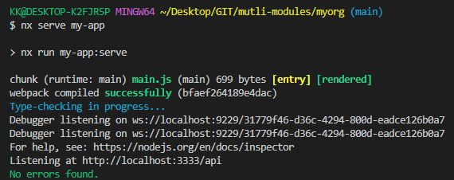

# 如何使用這個範例?
- 在跟目錄先安裝套件
  ```
    yarn
    # or
    npm i
  ```
- 此外**建議安裝nx在global**，就可以不用下npx來執行nx指令
- 準備好後嘗試下面指令
  ```
    nx serve my-app
  ```
- 沒意外的話就可以看到有執行一個service，可以在瀏覽器輸入 http://localhost:3333/api看看結果
  
- 其他更多細節可以多參考原文件

# nx.json在幹嘛?
## nx.json -- targetDefaults
- 裡面有三個 key: build, lint, test，主要是定義對每個專案下的命令要做的事情
- dependsOn 則是定義執行任務之前要先做的行為
- inputs 則是定義什麼條件下，該任務執行不使用快取 (比方說build code都會希望每次不用快取以避免某些問題)
- 可自行定義或新增，盡量是每個專案都適用的指令
- 可參考[官方文件](https://nx.dev/more-concepts/customizing-inputs)
- 裡面設定細節可參考[官方範例說明](https://nx.dev/more-concepts/customizing-inputs#scenario-1:-react-app)

## nx.json -- namedInputs
- 類似別名，用來設定該變數對應什麼檔案或路徑
- 主要讓 targetDefaults 去做引用

## nx.json -- workspaceLayout
- 定義nx產生專案的位置
- nx 產生library會在libsDir的位置
- nx 產生專案會在appsDir的位置
- 產生專案可以參考[官方文件](https://nx.dev/packages)，裡面針對很多如 Nest、Next、Express等專案的產生指令
